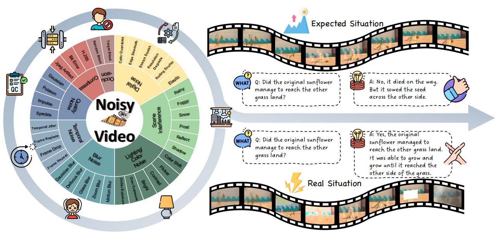
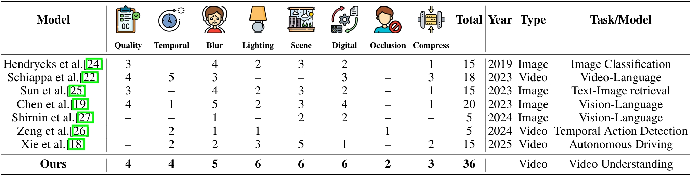

# NoiseEvalKit

**NoiseEvalKit** (tentative name) is a toolkit for assessing Video-LLM performance on **question answering tasks** under various **noise conditons** based on `VLMEvalKit`, which is an **open-source evaluation toolkit** of **large vision-language models**. Our toolkit encompasses **36 noise types** in 8 categories, and **9 question types** to comprehensively evaluate the robustness of Video-LLMs. By using the toolkit, we can evaluate the performance of state-of-the-art Video-LLMs for the initial systematic evaluation from multiple perspectives.

# Visual Noise

We introduce a wide range of noise types that reflect real-world situations in video data to evaluate the robustness of Video-LLMs. From the literature, we identify **36 types of different noise** due to capturing, processing, and saving.
To better analyze the impacts of different noises, we further categorize them into 8 groups by their characteristics. Namely, they are distinct noises related to **quality**, **temporality**, **blurring**, **lighting/color**, **scene interference**, **digitality**, **occlusion**, and **compression**.

Noise implementations are stored in the `video_noise` directory, organized into individual files by noise type/category.
|Noise types| Specific Noise |
|:--:|--|
| **Quality** <br>(4 types) |                                                                                **Gaussian**: *Gaussian white noise exhibits normal amplitude distribution and uniform spectral energy.*<br> **Impulse**: *brief, random spikes of noise that create sudden bright or dark pixels (salt-and-pepper effect).*<br> **Speckle**: *granular, multiplicative noise that creates a grainy texture by causing small intensity variations.* <br> **Poisson**: *signal-dependent noise from random photon arrival events.* <br>|
|**Temporality** <br>(4 types)|**Frame drop**: *random removal of entire frames from a video sequence.* <br>        **Frame replace**: *misordering of frames within a video sequence, causing temporal playback jumps.* <br>   **Frame repeat**: *duplication of frames within a video sequence, causing stuttering due to repeated frames.*<br> **Temporal jitter**: *combination of frame drops and frame misordering, causing uneven frame intervals, skipped or out-of-order frames, and jittery playback.*|
|**Blurring** <br>(5 types)|**Gaussian blur**: *smoothing distortion produced by convolving selected frames with a Gaussian kernel.* <br>**Motion blur**: *directional smearing of moving objects caused by camera or subject motion during exposure.* <br> **Defocus blur**: *optical softening from being out of the focal plane, producing uniform blur and bokeh (circle-of-confusion) around objects.* <br> **Glass blur**: *localized refractive distortion simulating viewing through textured or frosted glass, randomly displacing pixels within small neighborhoods to produce blurred and warped effects.* <br>**Zoom blur**: *blur effect caused by scaling the image (zooming in or out), stretching details radially and reducing sharpness.*| 
|**Lighting/Color**<br>(6 types)|**Bright transform**: *adjust video brightness in the HSV color space by scaling the V (value) channel to increase or decrease overall luminance.* <br> **Contrast transform**: *adjust contrast by scaling pixel values around a pivot.* <br> **Color shift**: *apply random additive or multiplicative shifts to each color channel (e.g., R, G, B) of selected frames, causing hue, saturation, and overall color balance distortions.* <br> **Flicker**: *random temporal variations in frame luminance, causing rapid brightness fluctuations that produce a trembling or flickering appearance.* <br>**Overexposure**: *clipping of pixel values to their maximum due to excessive luminance, resulting in washed-out highlights and loss of detail.* <br>**Underexposure**: *insufficient luminance from low exposure or gain, causing pixel values to cluster near zero, deep shadows, and loss of detail.*|
|**Scene interference**<br>(6 types)|**Rainy**: *add rain effects to video by generating fractal-based raindrop streaks and splashes, then blending them into selected frames with varying intensity and motion blur to simulate realistic rainfall.*<br> **Foggy**: *overlay a plasma-fractal noise–based fog mask onto selected frames, blending with adjustable density, falloff, and blur to simulate realistic atmospheric haze.* <br> **Snow**: *overlay simulated falling snowflakes onto video frames by generating particle effects to mimic realistic snowfall.*<br> **Frost**: *overlay semi-transparent ice-crystal (frost) textures, blending in subtle specular highlights and light scattering to mimic frozen surfaces.*<br> **Reflect**: *overlay mirror-like reflections modulated by Perlin-noise–generated distortion maps, blending specular highlights and warped environment details to simulate uneven reflective surfaces.* <br> **Shadow**: *overlay dark masks or gradients onto frames—adjusting region shape, opacity, and position—to simulate object shadows effects.*|
|**Digitality**<br>(6 types)|**Rolling shutter**: *simulate the rolling shutter by reading selected frame’s rows (or columns) sequentially with a line-by-line time offset, causing uniform skew, wobble, and temporal distortion across the selected frames.* <br>**Resolution degrade**: *reduce frame resolution by downsampling, causing blocky artifacts and blurred details due to loss of high-frequency information.*<br>**Stretch squish**: *scale frames horizontally or vertically, stretching or compressing pixel dimensions to modify aspect ratio and introduce geometric distortion.*<br>**Edge sawtooth**: *apply periodic, asymmetric “sawtooth”–shaped distortions along detected edges by shifting pixel positions or intensities in a linear ramp pattern, creating jagged boundary artifacts.*<br> **Color quantized**: *reduce the number of distinct colors by mapping pixel values to a limited palette, causing posterization and visible banding artifacts.*<br>**Elastic**: *apply smooth, random displacement fields to each frame—warping pixels in an elastic manner to simulate stretchy, fluid-like distortions.*|
|**Occlusion**<br>(2 types)|**Random block**: *randomly select rectangular regions in frames and replace them with black blocks.*<br> **Target block**: *detect primary objects with YOLO and overlay occluding blocks on their bounding boxes, masking the target regions in selected frames.*<br>|
|**Compression**<br>(3 types)|**JPEG artifact**: *lossy compression artifacts from JPEG encoding, characterized by ringing halos around sharp edges, and subtle color banding or blur of fine details.*<br>**Bit error**: *choose a random region of the frame and simulate bit-level corruption to produce stripe artifacts.*<br>**H265 artifacts**: *compression artifacts from H.265/HEVC encoding, characterized by blockiness at CTU boundaries, quantization noise, ringing halos around edges, and blurring in high-detail regions.*|

After completing the installation, you can use the following demo to evaluate the actual effects of each noise type:
```python
from video_noise.noise_applier import NoiseRegistry
from video_noise.utils import save_image

video_path = 'video_noise/sample/demo.mp4'
video_frames, _, info = torchvision.io.read_video(video_path, pts_unit="sec", output_format="TCHW")

print(video_frames.shape)
print(NoiseRegistry.list_noises())  # print all the video types
video = NoiseRegistry.get_noise('gaussian')(video_frames.clone(), 1)
save_image(video[0], 'sample.png')
```

# QuickStart
Refer to the [Quickstart](docs/QuickStart.md) guide for setup instructions.

# Acknowledgement
We sincerely thank [VLMEvalkit](https://github.com/open-compass/VLMEvalKit) for their pioneering works on large vision-language model evaluation. 
We also gratefully acknowledge the following open-source projects and pre-trained models, which significantly contributed to our implementation: [Ask-Anything](https://github.com/OpenGVLab/Ask-Anything), [Chat-UniVi](https://github.com/PKU-YuanGroup/Chat-UniVi), [LLaMA-VID](https://github.com/dvlab-research/LLaMA-VID), [LLaVA](https://github.com/haotian-liu/LLaVA), [PLLaVA](https://github.com/magic-research/PLLaVA), [Video-ChatGPT](https://github.com/Amshaker/Mobile-VideoGPT).

# License

This project is released under the Attribution-NonCommercial 4.0 International (CC BY-NC 4.0) license. Please see the LICENSE file for more information.
